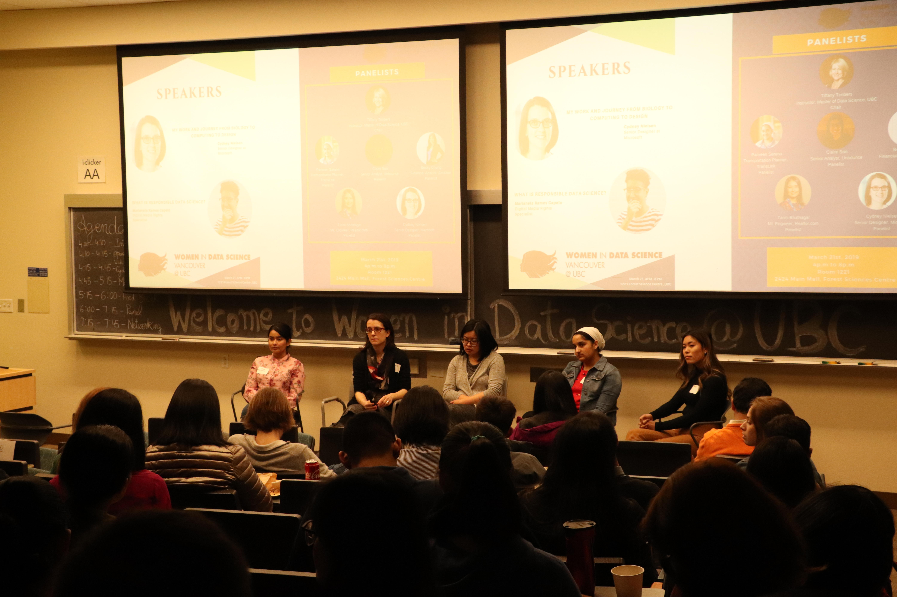
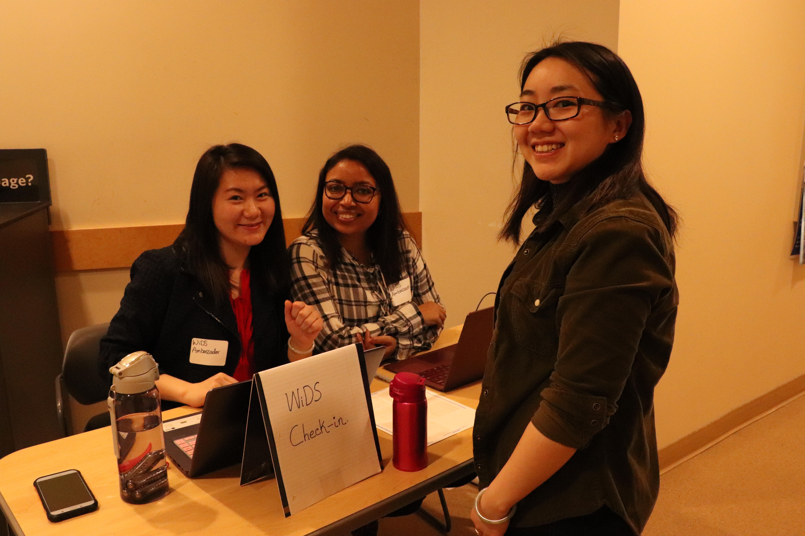
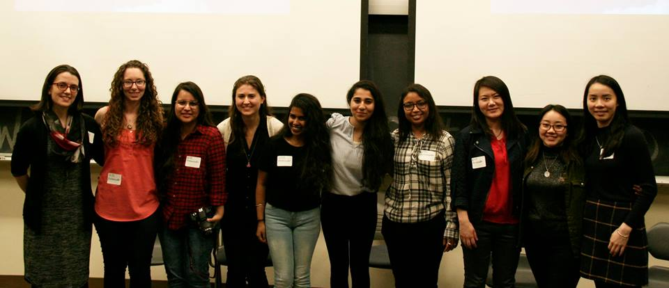

Date: 2019-03-28

On March 21, I organized the Women in Data Science with other brilliant women from UBC Master of Data Science Program. Here are some of the takeaways on how to organize a successfull data science event. 

:information_desk_person:

## Pre-event

### Brainstorm Event Topic & Agenda :bulb:
- Define your topic, event structure. 
- This agenda will come in handy when you talk to potential keynote speakers

### Speaker, Panelist Outreach 
- Email
- Linkedin
- Word of Mouth
- Slack
- Personal Connection
- Your Secret

### Event Promotion :loudspeaker:
- Make promotional material
- Eventbrite
- Meetup
- Linkedin
- Facebook
- Slack
- Twitter
- Ask your guests to share the event

### Logistics :ballot_box_with_check:
- Book venues according to your RSVP list 
- Check mic, facilities, amenities
- Assign specific tasks to a contact person

## During event
- Registration
- Promote event in realtime
- Take video/photos
- Make sure people are well-fed!

## Post event 
- Allow more time to mingle
- Write a Thank-you Card to your guests
- Blog about the event!

### What is the Women in Data Science (WiDS) Conference?

The Global Women in Data Science (WiDS) Conference aims to inspire and educate data scientists worldwide, regardless of gender, and support women in the field. This annual one-day technical conference provides an opportunity to hear about the latest data science-related research and applications in a broad set of domains, All genders are invited to participate in the conference, which features outstanding women doing outstanding work.

### What is WiDS UBC?

We are hosting the WiDS local conference at UBC on March 21st, 2019 4:00 pm - 8:00 pm. Our mission is to provide a local community for women interested in data science careers in Vancouver. Our speakers and panelist may have started their careers from some other industries but end up in data science. We’d love to hear about your current projects, the technologies you use, how you transformed from some other industries to your current role, your career advice etc.

